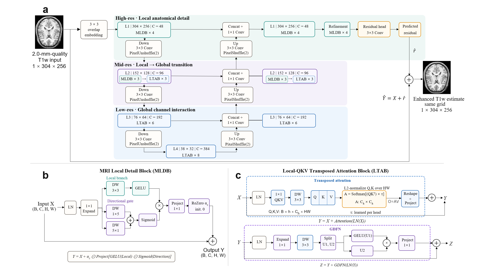

# MRI-LGFormer-T1: Stage-Specialized Local-Global Transformer for Same-Grid T1w MRI Enhancement

[](https://www.python.org/)
[](https://pytorch.org/)
[](#model-architecture)
[](LICENSE)

> 🧠 A deterministic Transformer framework for transforming 2.0-mm-quality T1-weighted brain MRI into a 0.7-mm-reference-quality estimate on the same spatial grid.



---

## 📖 Table of Contents

- [Abstract](#abstract)
- [Installation](#installation)
- [Dataset Preparation](#dataset-preparation)
- [Usage](#usage)
- [Model Architecture](#model-architecture)
- [Results](#results)
- [Repository Structure](#repository-structure)
- [License](#license)

<a id="abstract"></a>

## 🧠 Abstract

High-quality T1-weighted brain MRI is essential for accurately depicting fine anatomical structures, yet lower-quality acquisitions often suffer from blurred tissue boundaries and loss of structural details. Most existing restoration networks apply similar local or global feature modeling across different resolution stages, overlooking the substantial variation in feature characteristics along the network hierarchy. We propose LGFormer, a stage-specialized local--global Transformer for same-grid T1-weighted brain MRI enhancement. Our approach assigns local anatomical modeling to high-resolution stages and progressively introduces global channel interaction as the spatial resolution decreases, allowing the feature processing strategy to adapt to scale-dependent representation characteristics. To strengthen fine-detail recovery at high resolution, we develop an MRI Local Detail Block that combines isotropic local filtering with directional gating. At lower resolutions, a Local-QKV Transposed Attention Block incorporates local spatial encoding before channel-wise attention, enabling broader dependency modeling while retaining neighborhood information. Experiments on HCP-YA T1w data demonstrate that LGFormer consistently outperforms representative restoration methods, achieving 29.1362~dB PSNR and 0.880736 SSIM together with lower HFEN, MAE, and NMSE. Subject-level, qualitative, and ablation analyses further confirm that the proposed local-to-global stage allocation provides more accurate and structurally faithful brain MRI enhancement.


<a id="installation"></a>

## ⚙️ Installation

Python 3.10 or later and a CUDA-capable GPU are recommended for training.

```bash
git clone https://github.com/fengyan2025/LGFormer.git
cd LGFormer

python -m venv .venv
source .venv/bin/activate

pip install --upgrade pip
pip install -e .
pytest -q
```

The frozen experiments used PyTorch 2.4.1 with CUDA acceleration.

<a id="dataset-preparation"></a>

## 📂 Dataset Preparation

 Obtain authorized T1w data from the official HCP data provider and comply with the applicable data-use terms.

Each paired normalized NPZ file must contain a two-dimensional array under the key `image`. Prepare the manifest and subject-disjoint splits with:

```bash
python scripts/build_t1_manifest.py --help
python scripts/make_splits.py --help
python scripts/audit_splits.py --help
```

The expected CSV schema is documented in [`data/README.md`](data/README.md). Before training, update `paths.data_root` and the relevant manifest paths in [`configs/train_t1_main.yaml`](configs/train_t1_main.yaml).

The main experiment used the following subject-level partition:

| Split | Subjects | T1w pairs | Purpose |
|---|---:|---:|---|
| Train | 857 | 17,140 | Parameter optimization |
| Validation | 107 | 2,140 | Checkpoint selection |
| Test | 107 | 2,140 | One-time final evaluation |

<a id="usage"></a>

## 🚀 Usage

### Train from scratch

Train MRI-LGFormer-T1 from random initialization:

```bash
python scripts/train.py --config configs/train_t1_main.yaml
```

Frozen main-run settings:

| Setting | Value |
|---|---:|
| Seed | 20260730 |
| Maximum steps | 140,000 |
| Batch size | 2 |
| Crop size | 256 × 256 |
| Optimizer | AdamW |
| Learning rate | `2e-4 → 2e-6` cosine decay |
| Loss | Charbonnier + `0.1 ×` gradient loss |

### Select the checkpoint

Checkpoint selection uses **mean Global PSNR** on Validation. Among checkpoints within `0.01 dB` of the observed maximum, the earliest checkpoint is selected. Test data must not be used for model selection.

```bash
bash scripts/run_validation_selection.sh
```

The frozen rule selected step 120,000; the raw Validation maximum occurred at step 140,000, only `0.009818 dB` higher.

### Evaluate a trained checkpoint

```bash
python scripts/evaluate.py \
  --config configs/train_t1_main.yaml \
  --checkpoint runs/t1_main_seed20260730/checkpoint_step_120000.pth \
  --split validation \
  --output-dir results/local_validation \
  --expected-subjects 107 \
  --expected-pairs 2140
```

### Run inference

```bash
python scripts/infer.py \
  --checkpoint runs/t1_main_seed20260730/checkpoint_step_120000.pth \
  --input path/to/input.npz \
  --output path/to/enhanced.npz
```

The input NPZ must contain `image` with shape `H × W`; both dimensions must be divisible by eight. The enhanced image is stored under the same key in the output NPZ.

<a id="model-architecture"></a>

## 🏗️ Model Architecture

MRI-LGFormer-T1 contains approximately **24.90 million parameters** and follows a four-level U-shaped encoder-decoder:

```text
Low-quality T1w slice
        │
        ▼
3 × 3 overlapping embedding
        │
        ├─ L1: MLDB × 4                     (high-resolution local stage)
        ├─ L2: MLDB × 3 → LTAB × 3          (local-to-global transition)
        ├─ L3: LTAB × 6                      (low-resolution global stage)
        └─ L4: LTAB × 8                      (latent global stage)
        │
        ▼
Symmetric decoder + plain skip fusion
        │
        ▼
MLDB refinement × 4 → residual head
        │
        ▼
Enhanced image = input + predicted residual
```

### MRI Local Detail Block (MLDB)

For an input feature `X`, MLDB expands the channels and creates two complementary paths:

1. a depthwise `3 × 3` local branch followed by GELU;
2. parallel depthwise `1 × 5` and `5 × 1` directional branches followed by sigmoid gating.

Their gated interaction is projected back to the original channel dimension and added through a channel-wise ReZero residual scale initialized to zero. This design targets local tissue boundaries and directional anatomical structures while preserving stable optimization.

### Local-QKV Transposed Attention Block (LTAB)

LTAB uses a `1 × 1` QKV projection followed by depthwise `3 × 3` local QKV encoding. Q and K are L2-normalized along the spatial dimension, and attention is computed across channels rather than through an `HW × HW` spatial attention matrix. A GDFN sub-block then performs gated local feature transformation.


<a id="results"></a>

## 📊 Results

The step-120,000 model was selected on Validation and evaluated once on the frozen 107-subject Test split.

| Global PSNR ↑ | Foreground PSNR ↑ | Global SSIM ↑ | Foreground SSIM ↑ | NMSE ↓ | HFEN ↓ |
|---:|---:|---:|---:|---:|---:|
| **29.1362** | **28.1362** | **0.880736** | **0.861070** | **0.011475** | **0.239608** |

Additional Test metrics include Global MAE `0.044018`, Foreground MAE `0.053454`, gradient MAE `0.091928`, Foreground P95 `0.159106`, and Foreground P99 `0.278512`. All 107 Test subjects improved over their corresponding 2.0-mm-quality input in subject-mean Global and Foreground PSNR and MAE.

These values characterize performance on the frozen internal HCP-derived split. They do not establish superiority over every published method or external clinical generalization. See [`docs/RESULTS.md`](docs/RESULTS.md) and the aggregate files in [`results/`](results/) for the full report.

<a id="repository-structure"></a>

## 📁 Repository Structure

```text
configs/              Model, training, and ablation configurations
src/mri_lgformer/     MRI-LGFormer-T1 implementation
scripts/              Training, evaluation, inference, and data utilities
scripts/ablations/    Formal ablation utilities
ablation_models/      Isolated ablation variants
tests/                Shape, metric, dataset, and checkpoint tests
results/              Aggregate, non-subject-level experimental results
figures/              Model architecture figure
docs/                 Data, model, training, and reproducibility notes
```


<a id="license"></a>

## 📜 License

Copyright © 2026 MRI-LGFormer-T1 authors. All rights reserved.

The repository is publicly source-visible for academic inspection and reproducibility, but no permission to use, copy, modify, or redistribute the project is granted unless explicitly stated. 